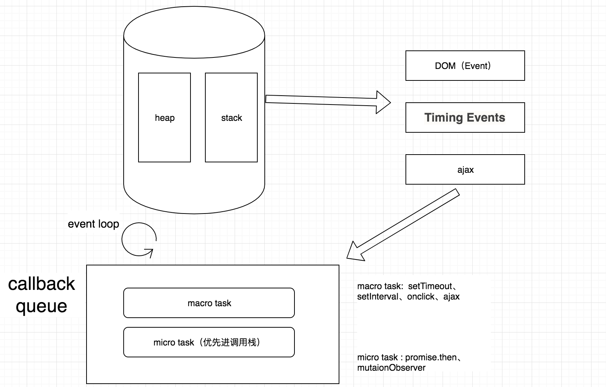

## JS事件循环和node事件循环

***node和js都保持了单线程的特点，javascript在最初设计时设计成了单线程,为什么不是多线程呢？如果多个线程同时操作DOM那岂不会很混乱？***

---

### JS事件循环

首先我们要知道js是干嘛的，和用户通过浏览器进行交互，如果同时两个任务操作一个dom，那不就乱套了。**单线程意味着，javascript代码在执行的任何时候，都只有一个主线程来处理所有的任务**

>但是呢，随着技术的进步，单线程确实限制了javascript的发展，所以因此出现了一个叫web worker的东西，从表面上来说是把javascript做成了多线程语言（为什么说是表面上，因为web orker 是受主线程控制的，等同于子线程，只能做一些次要的计算，处理数据的任务，无法操作I/O，本质上javascript还是单线程语言）

关于流程我画了幅图：



1. 首先所有同步任务都在主线程上执行，形成一个执行栈（就是那个大圆筒里面的stack，里面存在同步任务）。

2. 在这个主线程之外，存在一个事件队列，只要异步任务有了结果，就往事件队列里面放置一个任务。（比如说setTimeout时间到了，就往队列里面放执行的函数）

3. 如果执行栈中的任务执行完毕，就会去读取任务队列，推入栈，继续执行。

4. js是单线程的，但是浏览器是多线程的，不同的异步任务是由不同的浏览器内核的模块来执行的 
>onclick 由浏览器内核的 DOM Binding ；setTimeout 会由浏览器内核的 timer 模块；ajax 则会由浏览器内核的 network 模块

5. event loop里面至少有两个队列，一个是macrotask(宏任务),一个是microtask(微任务)。读取任务队列的时候会优先读取微任务，然后执行完之后才会读取宏任务 （ps: 特别的，如果微任务在执行过程中，又有微任务进了队列，执行完之后，还会优先读取微任务，直到所有微任务读取完，才会读取宏任务 ~~~ 没错 就是这么卑微...）

浏览器的事件循环可以理解为：

- 先执行一个 MacroTask，然后执行所有的 MicroTask；
- 再执行一个 MacroTask，然后执行所有的 MicroTask；
- .....
---

### node的事件循环

node的事件循环要比浏览器中的要复杂一点，node中事件循环的实现是依靠的libuv引擎（我们现在主要说node 11 版本之前的）。

**其实nodejs与浏览器的区别，就是nodejs的 MacroTask 分好几种，而这好几种又有不同的 task queue，而不同的 task queue 又有顺序区别，而 MicroTask 是穿插在每一种【注意不是每一个！】MacroTask 之间的。**

>注意，在 node 11 版本中，node 下 Event Loop 已经与浏览器趋于相同。  
>注意，在 node 11 版本中，node 下 Event Loop 已经与浏览器趋于相同。  
>注意，在 node 11 版本中，node 下 Event Loop 已经与浏览器趋于相同。  

下面是node的事件循环图解：  

```
   ┌───────────────────────┐
┌─>│        timers         │<————— 执行 setTimeout()、setInterval() 的回调
│  └──────────┬────────────┘
|             |<-- 执行所有 Next Tick Queue 以及 MicroTask Queue 的回调
│  ┌──────────┴────────────┐
│  │     pending callbacks │<————— 执行由上一个 Tick 延迟下来的 I/O 回调（待完善，可忽略）
│  └──────────┬────────────┘
|             |<-- 执行所有 Next Tick Queue 以及 MicroTask Queue 的回调
│  ┌──────────┴────────────┐
│  │     idle, prepare     │<————— 内部调用（可忽略）
│  └──────────┬────────────┘     
|             |<-- 执行所有 Next Tick Queue 以及 MicroTask Queue 的回调
|             |                   ┌───────────────┐
│  ┌──────────┴────────────┐      │   incoming:   │ - ( 获取新的 I/O 事件；nodejs这时会适当进行阻塞；）
│  │         poll          │<─────┤  connections, │ 
│  └──────────┬────────────┘      │   data, etc.  │ 
│             |                   |               | 
|             |                   └───────────────┘
|             |<-- 执行所有 Next Tick Queue 以及 MicroTask Queue 的回调
|  ┌──────────┴────────────┐      
│  │        check          │<————— setImmediate() 的回调将会在这个阶段执行
│  └──────────┬────────────┘
|             |<-- 执行所有 Next Tick Queue 以及 MicroTask Queue 的回调
│  ┌──────────┴────────────┐
└──┤    close callbacks    │<————— socket.on('close', ...)
   └───────────────────────┘
```
node的事件循环可以理解为：

- 先执行所有类型为 timers 的 MacroTask，执行NextTick，然后执行所有的 MicroTask（
- 进入 poll 阶段，执行几乎所有 MacroTask，执行NextTick，然后执行所有的 MicroTask；
- 再执行所有类型为 check 的 MacroTask，执行NextTick，然后执行所有的 MicroTask；
- 再执行所有类型为 close callbacks 的 MacroTask，执行NextTick，然后执行所有的 MicroTask；
- 至此，完成一个 Tick，回到 timers 阶段；

---

### node事件需要注意的点

#### 一.setTimeout 与 setImmediate

我们根据上面的可以看到，timer在check之前，但是实际情况是**这两个执行的顺序会因为它们被调用时的上下文而有所不同。**  

比如说下面代码：
```
fs.readFile(__filename, () => {
  setTimeout(() => {
    console.log('timeout')
  }, 0)
  setImmediate(() => {
    console.log('immediate')
  })
})
```
我们可以看到，两个事件是放在io循环里面，所以当前的阶段处于poll,所以check会在timer之前。  

如果我们在非 I/O 循环中运行下面的脚本（即在主模块中），他俩的顺序是不固定的，因为会受到进程性能的影响：

```
setTimeout(() => {
  console.log('timeout')
}, 0)

setImmediate(() => {
  console.log('immediate')
})
```
这段代码的执行结果是不定的。
虽然 setTimeout 延时为 0，但是一般情况 Node 把 0 会设置为 1ms，所以，当 Node 准备 event loop 的时间大于 1ms 时，进入 timers 阶段时，setTimeout 已经到期，则会先执行 setTimeout；反之，若进入 timers 阶段用时小于 1ms，setTimeout 尚未到期，则会错过 timers 阶段，先进入 check 阶段，而先执行 setImmediate


#### 二.Poll阶段

poll 阶段主要有两个功能：

- 获取新的 I/O 事件，并执行这些 I/O 的回调，之后适当的条件下 node 将阻塞在这里
- 当有 immediate 或已超时的 timers，执行它们的回调

poll阶段是获取并执行几乎所有的io事件，是event loop的重要阶段，它首先执行完自己的poll queue的callbacks,然后结束poll阶段，然后执行：

1.setImmediate 的 queue 不为空，则进入 check 阶段.  
2.setImmediate 的 queue 为空，但是 timers 的 queue 不为空，则直接进入 timers 阶段，然后又来到 poll.
3.setImmediate 的 queue 为空，timers 的 queue 也为空，此时会阻塞在这里，因为无事可做

#### 三.nextTick

nextTick队列是穿插在node事件循环的每一个队列中，从上面可以看到，每执行一个一个事件阶段的宏任务之后就会执行nextTick队列的事件，然后再执行微任务，全部执行完之后再进入下一个事件阶段。

```
   ┌───────────────────────┐
┌─>│        timers         │
│  └──────────┬────────────┘
|      nextTick（队列执行）
│  ┌──────────┴────────────┐
│  │     I/O callbacks     │
│  └──────────┬────────────┘
|       nextTick（队列执行）
│  ┌──────────┴────────────┐
│  │     idle, prepare     │
│  └──────────┬────────────┘      
|      nextTick（队列执行）         ┌───────────────┐
│  ┌──────────┴────────────┐      │   incoming:   │
│  │         poll          │<─────┤  connections, │
│  └──────────┬────────────┘      |               |
|      nextTick（队列执行）         │   data, etc.  │
│  ┌──────────┴────────────┐      └───────────────┘
│  │        check          │
│  └──────────┬────────────┘
|       nextTick（队列执行）
│  ┌──────────┴────────────┐
└──┤    close callbacks    │
   └───────────────────────┘
```

上面的图其实没有写清楚，微任务队列追加在process.nextTick队列的后面，也属于本轮循环。

简单来说 每一个事件阶段都是本身的宏任务 > nexTick > 本身的微任务

下面有一道题
```
console.log('main')

process.nextTick( () => {
  console.log('process.nextTick1')
})

setTimeout(() => {
  console.log('setTimeout')
  process.nextTick(() => {
    console.log('process.nextTick2')
  })
}, 0)

new Promise((resolve, reject) => {
  console.log('promise')
  resolve()
}).then(() => {
  console.log('promise then')
})

console.log('main2')
```
1、首先先找全局的宏任务(Main 进程),所以先是打印main,然后打印promise，再是main2;
2、宏任务找完之后，找nextTick 招到了全局nextTick只有一个，打印process.nextTick1;
3、nextTick找完，接着寻找全局微任务，所以打印promise then;
4、全局的找完之后，进入下一个阶段timer，招到了setTimeout 所以打印setTimeout;
5、然后寻找NextTick找到并打印process.nextTick2,然后寻找微任务，没有。结束

所以答案是  
main  
promise  
main2  
process.nextTick1  
promise then  
setTimeout  
process.nextTick2  
