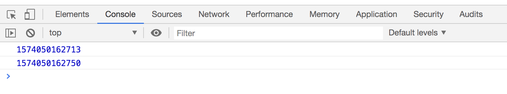
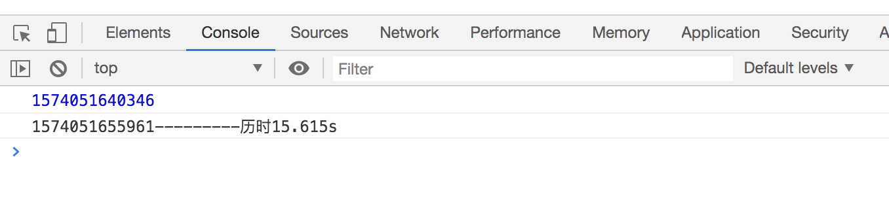
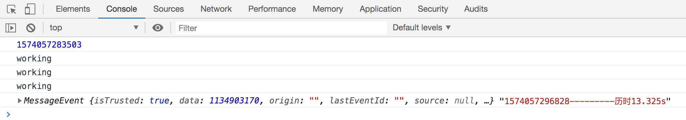
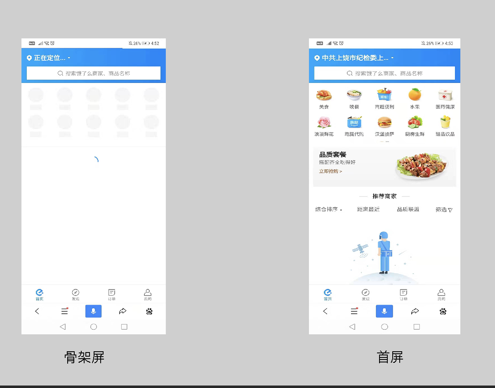
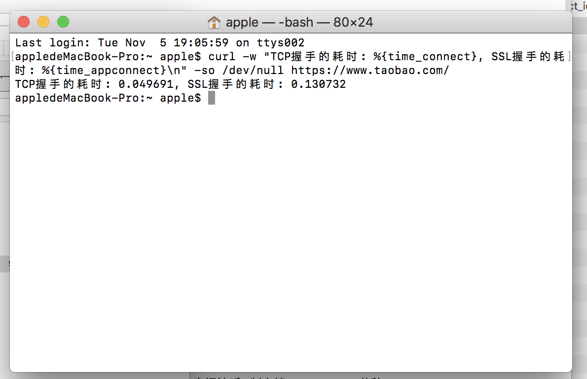

## 你不知道的web性能优化

你遇到过打开一个网站需要10秒以上的吗，这种网页响应非常缓慢，占用大量的CPU和内存，浏览起来常常有卡顿，页面的动画效果也不流畅。你会有什么反应？我猜想，大多数用户会关闭这个页面，改为访问其他网站。作为一个开发者，肯定不愿意看到这种情况，那么怎样才能提高性能呢

---

### 使用Web Worker

Web Worker 是HTML5 提供的一个javascript多线程解决方案，运行在浏览器后台。如我们所知js是个单线程的，js引擎在运行js的时候，不能干其他事。不过在使用中需要注意以下几点：  

- 它是一种JavaScript 工作线程，不能直接访问DOM

- 能发送网络请求。

- 它在不用时会被中止，并在下次有需要时重启

- 在开发过程中，可以通过 localhost 使用服务工作线程，但如果要在网站上部署服务工作线程，需要在服务器上设置 HTTPS。

- Worker 线程无法读取本地文件，即不能打开本机的文件系统（file://），它所加载的脚本，必须来自网络，这样做主要是为了安全，因为是可以通讯的，如果被别人修改了文件，引入了本地的js，进行通讯就会出现问题，所以只能访问同源的网络文件。（**重点，所以本地调试的时候需要开启服务，用node或者后台语言启动**）

#### web Worker 与主线程的交互速度

我们用代码来看下从主线程 --> web worker --> 主线程 最简单的需要多长时间。

```


// index.html

<!DOCTYPE html>
<html lang="en">
<head>
    <meta charset="UTF-8">
    <title>webWorker</title>
</head>
<body>
    <div class="content">

    </div>
    <script>
        var worker = new Worker("worker.js");
        console.log(new Date().getTime()) // 开始时间
        worker.postMessage("123456")
        worker.onmessage = function (e) {
            console.log(new Date().getTime()) // 接收时间
        }
    </script>
</body>
</html>
```

```
// webWorker.js

onmessage =function (evt){
  var d = evt.data  //通过evt.data获得发送来的数据
  postMessage( d )  //将获取到的数据发送会主线程
}

```




经过几次测试，大概的事件在30-50ms之间（当然这个值会随着机器性能问题有大有小），正常的传输速度是很快的。

#### web Worker 优化策略与实践

##### 案例：大量的js计算（fibonacci数列计算）

```
var worker = new Worker("worker.js");
let beginTime = new Date().getTime()
console.log(beginTime)
let fibonacci = (n) =>{
    return n <2? n : fibonacci(n -1) + fibonacci(n -2);
};

fibonacci(45)
let endTime = new Date().getTime()
console.log(`${endTime}---------历时${(endTime-beginTime)/1000}s`)
```

我们在主线程计算fibonacci(45)看看需要多少时间，在计算的时候页面是卡主的，会非常影响用户体验。



然后我们看看放在web worker里面是什么情况。  

```
// index.html
var worker = new Worker("worker.js");
let beginTime = new Date().getTime()
console.log(beginTime)
worker.postMessage("fibonacci");
worker.onmessage = function (e) {
    let endTime = new Date().getTime()
    console.log(e,`${endTime}---------历时${(endTime-beginTime)/1000}s`)
};
console.log("working")
console.log("working")
console.log("working")
```

```
// worker.js
onmessage =function (evt){
  var d = evt.data;//通过evt.data获得发送来的数据
  let fibonacci = (n) =>{
    return n <2? n : fibonacci(n -1) + fibonacci(n -2);
  };
  let data = fibonacci(45)
  postMessage(data);//将获取到的数据发送会主线程
}
```



可以看到，计算的时间是差不多的，但是并没有阻碍页面的运行。所以，一些高计算耗费时间的功能，可以放到web worker中计算完成后再返回回来。

---

### SPA项目首页白屏问题

现在三大框架（vue,react,angular）的兴起，越来越多的项目采用SPA这种接近原生app体验的架构方式。采用SPA模式，就意味着，首页或者main.js过大，首屏加载的速度会受到很大的限制。会存在一定时间的白屏。

SPA项目因为html都是js去生成的（虚拟Dom原理），所以在js没有执行加载完之前，dom是不会有的。一开始客户端从服务端获取到html只是一个空壳，所以会显示白屏。

下面列出一些解决方案

#### 1.服务端渲染SSR（加快首屏加载和SEO）   
SSR是一个可以有效的提高首屏渲染速度的方法，之后我会开单张去单独实践服务端渲染。

#### 2.预渲染  
  预渲染是一个方案，使用爬虫技术。由于我们打包过后的都是一些js文件，使用一些技术（puppeteer）可以爬取到项目在chrome浏览器展示的页面，然后把它写入js,和打包文件一起。类似**prerender-spa-plugin**
  >不过这种技术的缺点也很明显，我们在打包过程中，所展示的页面是当时环境下的数据，也就是说如果首页有很多的动态获取的数据（比如说实时的股票价格），那如果采用这种方案，用户第一眼看到并不是当时数据，会认为是个错误信息。

#### 3.骨架屏（占位块和图片）  
  骨架屏可以说现在比较实用的首屏优化技术了，方便也不是很复杂。骨架屏类似于app的启动页，一般我们进入app都会有宣传的启动页，然后才看到首页。**骨架屏就是这样，用户进来首先看到的是骨架屏，然后首页渲染完之后，再把骨架屏干掉。**   
  骨架屏主要有两种方式可以完成：

  - 通过编译的时候自动生成  
  还是**puppeteer（上面说了预渲染也用，它主要是能在代码里面唤起chrome浏览器，或者后台唤起，也就是没有弹出浏览器，但是可以获取到真实浏览器中渲染的内容）**，有了它我们就能获取到浏览器里面的dom元素，然后通过对页面中元素进行删减或增添，对已有元素进行修改生成我们想要的骨架，然后将修改后的 HTML 和 CSS 样式提取出来，这样就是骨架屏了。当然遇到了图片的话，还是需要转成svg的形式，或者base64这样就不需要网络请求了。

  - 通过设计图+布局
  这是一种直接重新写一个页面的方式，图片的话采用svg和base64的形式，生成一个dom,解析注入到服务器返回的index.html里面（ssr render注入）。

  现在网络上的项目，最能提现的就是饿了么的h5了，我们可以通过手机浏览器打开饿了么。




我们首先看到是骨架屏，然后过一会才会看到首屏，这就是饿了么用了这种技术，很大的提高了用户的体验。[page-skeleton-webpack-plugin](https://github.com/ElemeFE/page-skeleton-webpack-plugin)项目地址

---

### SSL延迟有多大？

我们知道http是经过TCP三次握手就可以成功通讯 。再来看Https链接，它也采用TCP协议发送数据，所以它也需要上面的这三步握手过程。而且，在这三步结束以后，它还有一个SSL握手。

>HTTP耗时 = TCP握手 ; HTTPS耗时 = TCP握手 + SSL握手

在研究ssl延迟之前，我们先来学一个命令行工具**curl**，-w,–write-out参数。顾名思义，write-out的作用就是输出点什么。curl的-w参数用于在一次完整且成功的操作后输出指定格式的内容到标准输出。

主要了解下几个参数：

- http_code http状态码

- time_total 总时间，按秒计。

- time_namelookup DNS解析时间,从请求开始到DNS解析完毕所用时间

- time_connect 连接时间,从开始到建立TCP连接完成所用时间,

- time_appconnect 连接建立完成时间，如SSL/SSH等建立连接或者完成三次握手时间。

我们主要用time_connect（TCP握手的耗时），time_appconnect（SSL握手的耗时）

终端输入`curl -w "TCP握手的耗时: %{time_connect}, SSL握手的耗时: %{time_appconnect}\n" -so /dev/null https://www.taobao.com`  




我们可以看到ssl耗时是tcp的三倍左右，具体数字取决于CPU的快慢和网络状况。  
>所以，如果是对安全性要求不高的场合，为了提高网页性能，建议不要采用保密强度很高的数字证书。

---

### 防抖节流那些事

在开发过程中我们很多时候会碰到需要防抖和节流去解决问题。不要小看它们，没有它们的话，特定情况下的会造成很大的性能阻塞。

- 防抖（当持续触发事件时，一定时间段内没有再触发事件，事件处理函数才会执行一次）
  防抖我们可以理解为，存在一个scroll事件，只要滚动就会触发handler回调函数，防抖的处理是，等scroll事件完全停下来1000ms（这个值自行设定）之后，再出触发handler函数。

- 节流（当持续触发事件时，保证一定时间段内只调用一次事件处理函数） 
  节流顾名思义，触发scroll事件的时候，并不立即执行handle函数，每隔1000ms（这个值自行设定）才会执行一次handle函数

区别：节流是每一个时间段之后就会触发一次，存在间隙的连续触发，而防抖不一样，只会在最后才触发一次。

---

### 重排与重绘的相爱相杀

从前面的文章（浏览器渲染过程剖析）已经学到了网页的生成过程。
- HTML代码转化成DOM
- CSS代码转化成CSSOM（CSS Object Model）
- 结合DOM和CSSOM，生成一棵渲染树（包含每个节点的视觉信息）
- 生成布局（layout），即将所有渲染树的所有节点进行平面合成
- 将布局绘制（paint）在屏幕上

1-3步都很快，耗时的是第四步和第五步。这两步合称”渲染“,在网上生成的过程中，网页至少会渲染一次。
有三种情况会导致浏览器重新渲染

1.修改DOM  
2.修改样式表  
3.用户事件（比如鼠标悬停、页面滚动、输入框键入文字、改变窗口大小等等）  

**重新渲染，就需要重新生成布局和重新绘制。前者叫做"重排"（reflow），后者叫做"重绘"（repaint）。**
重排和重绘不断的触发，是影响网页性能低下的根本原因。**提高网页性能，就是要降低"重排"和"重绘"的频率和成本，尽量少触发重新渲染。重排必定会重绘，而重绘不一定重排**