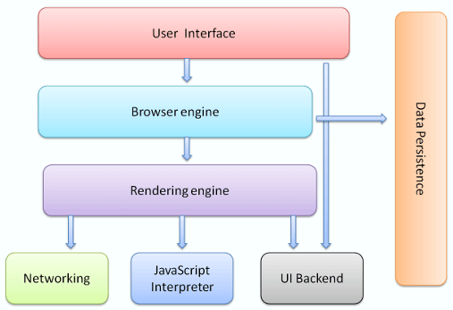
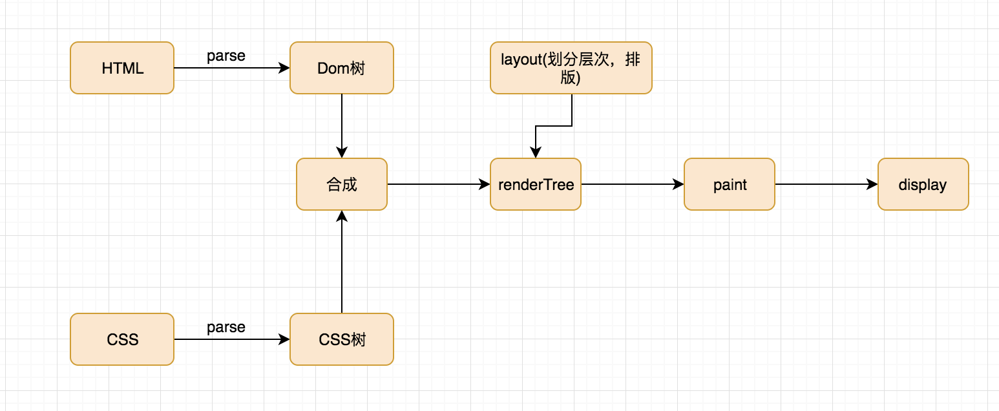

## 浏览器渲染过程剖析

作为一个前端，不了解浏览器在干什么，不是个合格的前端哦~

--- 

首先先贴一张图，网上找的~  


我们可以看到，主要的组件部分有7大部分。  


- 用户看到的界面（User interface）  我们可以打开浏览器，除了主窗口（你的页面内容）之外的其他地方，地址栏，前进后退，tab之类的。
- 浏览器引擎（Browser engine）  用来查询及操作渲染引擎的接口
- 渲染引擎（Rendering engine）
  把请求到的资源展现给用户

- 网络（Networking） 网络请求调用，如http,socket之类的
- UI Backend（UI Backend） 绘制基本的窗体小部件，如组合框、弹窗。
- JS解释器（javascript interpreter） 解析和执行 JS 代码
- 数据存储（Data persistence） 存储数据的地方，如cookie,localstorage

---
&nbsp;  
### 从输入url到页面呈现

很多面试官都会问到一个问题***从输入Url到页面展示浏览器发生了什么？*** 

- 1.输入网址，首先查找本地hosts,有这个域名存在的话使用 hosts 文件里面的 ip 地址，没有的话查询DNS服务器，得到IP地址。

- 2.建立TCP连接，通过***三次握手***，关于三次握手简单来说就是  
客户端：我要请求连接！  
服务端：好的我接到了，你还在吗？
客户端：在呢  
.... 个人理解，详细的话，可以去看百度百科，里面对三次握手讲的很详细。

- 3.客户端发送http请求

- 4.服务端处理，并返回结果给客户端

- 5.关闭TCP连接，需要***四次挥手***

- 6.浏览器收到结果的时候，开始解析资源（JS,CSS,HTML），浏览器通过解析html生成dom树，然后同时解析css资源与dom树相结合生成渲染树。
（在解析css的同时 是可以继续继续加载解析html，你是碰到js的时候，会阻塞html）

- 7.根据渲染树渲染页面 

--- 

&nbsp;  
&nbsp;


### 渲染过程
#### 浏览器渲染进程会开启多个线程协作完成，

1、GUI渲染线程

  - 负责渲染浏览器界面，解析HTML,CSS,构建DOM树和RenderObject树，布局和绘制等。
  - 当界面需要重绘或由于某种操作引发回流时，该线程就会执行。

2、JS引擎线程
  - S引擎线程负责解析JavaScript脚本，运行代码。 

3、事件触发线程  
  - 当一个事件被触发时该线程会把事件添加到待处理队列的队尾，等待JS引擎的处理  

4、定时器触发线程  
5、异步Http请求线程  
> GUI渲染线程与JS引擎线程是互斥的，也就是我们解析js的时候，当JS引擎执行时是被挂起的，要等js执行完毕时，GUI渲染线程才能被执行,而3、4、5是依赖js引擎线程的队列机制来完成的。

下面这张图是我画的浏览器的渲染过程。



--- 

**浏览器渲染的时候有几个问题是我们需要关注的：**

#### 1.浏览器的HTML容错机制

比如Html代码如下：  
```
  <div>
    <span>123
  </div>
    </span>
```
>在这里面我们违反了语法规则，但是浏览器还是会正确的把元素渲染出来。是因为html解析器中有添加容错和纠错的功能。


#### 2.处理脚本和样式的顺序

1、`<script>`标签会阻塞DOM解析和渲染
>大家应该都知道`<script>`标签的加载、解析和运行都会阻塞DOM的解析和渲染。这是因为javascript可以操作DOM元素，所以浏览器为了防止渲染过程出现不可预期的结果，让GUI渲染线程和js引擎线程互斥，同时带src的`<script>`标签会触发页面Paint，而inline的`<script>`标签不会。

2、`<link>`标签不会阻塞DOM解析但会阻塞DOM渲染
>DOM的解析和CSSOM的解析是一个并行的过程。两者互不影响。两者解析完成之后，会合并生成rending tree，之后就是layout和paint阶段，渲染到页面中，但是`<link>`标签会阻塞js的执行,但不会阻塞js加载。

3、带有async或defer属性的`<script>`标签,浏览器继续渲染，但是不同的浏览器会有兼容性问题

4、在`<link>`标签中加入rel="preload" as = "font"该元素属性，不会造成渲染阻塞,属于预加载。

### 3.重绘（repaint）与重排（reflow）

>重新渲染，就需要重新生成布局和重新绘制。前者叫做"重排"（reflow），后者叫做"重绘"（repaint）。"重绘"不一定需要"重排"，"重排"必然导致"重绘"。重排和重绘会不断触发，这是不可避免的。但是，它们非常耗费资源，是导致网页性能低下的根本原因。提高网页性能，就是要降低"重排"和"重绘"的频率和成本，尽量少触发重新渲染。  
&nbsp;
- 重绘（repaint）
  重绘是指一个元素外观的改变所触发的浏览器行为，浏览器会根据元素的新属性重新绘制，使元素呈现新的外观。  
  触发重绘的条件：改变元素外观属性。如：color，background-color等。

- 重排（reflow）
  重排是指改变元素排列结构所触发的浏览器行为，当渲染树中的一部分(或全部)因为元素的规模尺寸，布局，隐藏等改变而需要重新构建, 这就称为重排(reflow)。每个页面至少需要一次重排，就是在页面第一次加载的时候。
