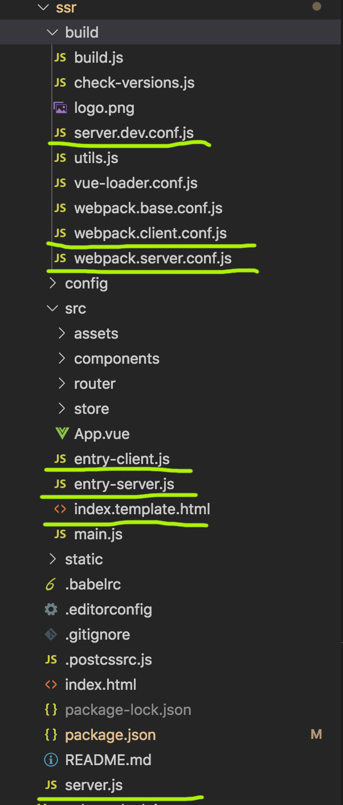

## 15分钟学会vue项目改造成SSR

**Ps：网上看了好多服务器渲染的例子，基本都是从0开始的，用Nuxt或者vue官网推荐的ssr方案（vue-server-renderer），但是我们在开发过程中基本上是已经有了现有的项目了，我们所要做的是对现有项目的SSR改造。那么这里，跟我一起对一个vue-cil2.0生成的项目进行SSR改造**

关于这篇文章的案例源代码我放在我的[github](https://github.com/193Eric/blog/tree/master/vue/SSR)上面，有兴趣的同学，也可以去我的github查看我之前写的博客。[博客](https://github.com/193Eric/blog)

---

### 一、改造技术的分析对比。

一般来说，我们做seo有两种方式：  

1、预渲染

我在性能优化的博客中说过，预渲染的问题，预渲染是一个方案，使用爬虫技术。由于我们打包过后的都是一些js文件，使用一些技术（puppeteer）可以爬取到项目在chrome浏览器展示的页面，然后把它写入js,和打包文件一起。  

类似**prerender-spa-plugin** 。最大的特点就是，所有获取的数据都是静态的，比如说你的页面首页有新闻，是通过接口获取的，当你在2019-11-30打包之后，不管用户在2020年也是看到的2019-11-30的新闻，当然的爬虫爬到的也是。  

如果你只需要改善少数页面（例如 /, /about, /contact 等）的 SEO，那么你可能需要预渲染

2、服务端渲染

服务端渲染是将完整的 html 输出到客户端，又被认为是‘同构’或‘通用’，如果你的项目有大量的detail页面，相互特别频繁，建议选择服务端渲染。  

**服务端渲染除了SEO还有很多时候用作首屏优化，加快首屏速度，提高用户体验。**但是对服务器有要求，网络传输数据量大，占用部分服务器运算资源。  

由于三大框架的兴起，SPA项目到处都是，所以涌现了一批nuxt.js、next.js这些服务器渲染的框架。但是这些框架构建出来的项目可能文件夹和我们现有的项目很大不一样，所以本文章主要是用**vue-server-renderer**来对现有项目进行改造，而不是去用框架。

**ps:（划重点）单页面项目的ssr改造的原理：**  

vue项目是通过虚拟 DOM来挂载到html的，所以对spa项目，爬虫才会只看到初始结构。虚拟 DOM，最终要通过一定的方法将其转换为真实 DOM。虚拟 DOM 也就是 JS 对象，整个服务端的渲染流程就是通过虚拟 DOM 的编译成完整的html来完成的。  

我们通过服务端渲染解析虚拟 DOM成html之后，你会发现页面的事件，都没法触发。那是因为服务端渲染**vue-server-renderer**插件并没有做这方面的处理，所以我们需要客户端再渲染一遍，简称**同构**。所以Vue服务端渲染其实是渲染了两遍。下面给出一个官方的图：


---

### 二、改造前后目录文件对比

   
  
  

黄线部分是改造后新增的文件，怎么样，是不是觉得差别不大，总体架构上只有6个文件的差别。(#^.^#) 我们来理一理这些新增的文件。

- server.dev.conf.js 本地调试和热更新需要的配置文件

- webpack.client.conf.js 客户端打包配置文件，ssr打包是生成分为客户端和服务端的两部分打包文件

- webpack.server.conf.js 服务端打包配置文件，ssr打包是生成分为客户端和服务端的两部分打包文件

- entry-client.js 客户端入口文件。spa的入口是main.js，ssr就分为两个入口（服务端和客户端）

- entry-server.js 服务端入口文件。spa的入口是main.js，ssr就分为两个入口（服务端和客户端）

- index.template.html 模板文件，因为服务端渲染是通过服务器把页面丢出来，所以我们需要一个模板，作为页面初始载体，然后往里面添加内容。

- server.js 启动文件，服务端渲染我们需要启动一个node服务器，主要配置在这个文件里面。


---

### 三、webpack添加客户端与服务端配置

#### 1.webpack客户端配置

```
const webpack = require('webpack')
const merge = require('webpack-merge')
const baseConfig = require('./webpack.base.conf.js')
const HtmlWebpackPlugin  = require('html-webpack-plugin')
const path = require('path')
const VueSSRClientPlugin = require('vue-server-renderer/client-plugin')

module.exports = merge(baseConfig, {
  entry: './src/entry-client.js',
  plugins: [
    new webpack.optimize.CommonsChunkPlugin({
      name: "manifest",
      minChunks: Infinity
    }),
    // 此插件在输出目录中
    // 生成 `vue-ssr-client-manifest.json`。
    new VueSSRClientPlugin(),
    new HtmlWebpackPlugin({
      template: path.resolve(__dirname, './../src/index.template.html'),
      filename: 'index.template.html'
    })
  ]
})
```

这里面和spa项目有两点不同，第一是入口变了，变为了entry-client.js。第二是VueSSRClientPlugin，这个是生成一个vue-ssr-client-manifest.json客户端入口文件。

#### 2.webpack服务端配置

```
const merge = require('webpack-merge')
const nodeExternals = require('webpack-node-externals')
const baseConfig = require('./webpack.base.conf.js')
const VueSSRServerPlugin = require('vue-server-renderer/server-plugin')

module.exports = merge(baseConfig, {
  // 将 entry 指向应用程序的 server entry 文件
  entry: './src/entry-server.js',

  // 这允许 webpack 以 Node 适用方式(Node-appropriate fashion)处理动态导入(dynamic import)，
  // 并且还会在编译 Vue 组件时，
  // 告知 `vue-loader` 输送面向服务器代码(server-oriented code)。
  target: 'node',

  // 对 bundle renderer 提供 source map 支持
  devtool: 'source-map',

  // 此处告知 server bundle 使用 Node 风格导出模块(Node-style exports)
  output: {
    libraryTarget: 'commonjs2'
  },
  externals: nodeExternals({
    // 不要外置化 webpack 需要处理的依赖模块。
    // 你可以在这里添加更多的文件类型。例如，未处理 *.vue 原始文件，
    // 你还应该将修改 `global`（例如 polyfill）的依赖模块列入白名单
    whitelist: /\.css$/
  }),

  // 这是将服务器的整个输出
  // 构建为单个 JSON 文件的插件。
  // 默认文件名为 `vue-ssr-server-bundle.json`
  plugins: [
    new VueSSRServerPlugin()
  ]
})
```

这段代码一目了然，第一是是告诉webpack这是要打包node能运行的东西，第二是打包一个服务端入口vue-ssr-server-bundle.json

--- 

### 四、vue、router、store实例改造

当编写纯客户端 (client-only) 代码时，我们习惯于每次在新的上下文中对代码进行取值。但是，Node.js 服务器是一个长期运行的进程。当我们的代码进入该进程时，它将进行一次取值并留存在内存中。这意味着如果创建一个单例对象，它将在每个传入的请求之间共享。

nodejs是一个运行时，如果只是个单例的话，所有的请求都会共享这个单例，会造成状态污染。所以我们需要为每个请求创造一个vue,router,store实例。

第一步修改main.js

```
// main.js
import Vue from 'vue'
import App from './App.vue'
import { createRouter } from './router'
import { createStore } from './store/store.js'
import { sync } from 'vuex-router-sync'

export function createApp () {
  // 创建 router 实例
  const router = createRouter()
  const store = createStore()

  // 同步路由状态(route state)到 store
  sync(store, router)

  const app = new Vue({
    // 注入 router 到根 Vue 实例
    router,
    store,
    render: h => h(App)
  })

  // 返回 app 和 router
  return { app, router, store }
}
```
看到这个createApp没，没错，它就是我们熟悉的工厂模式。同样的store和router一样改造

```
// router.js
import Vue from 'vue'
import Router from 'vue-router'
import HelloWorld from '@/components/HelloWorld'

Vue.use(Router)


export let createRouter = () => {
  let route  = new Router({
    mode:'history',
    routes: []
  })
  return route
}
```


```
// store.js
// store.js
import Vue from 'vue'
import Vuex from 'vuex'

Vue.use(Vuex)

export function createStore () {
  return new Vuex.Store({
    state: {
    },
    actions: {
    },
    mutations: {
    }
  })
}
```
到这里，三个实例对象改造完成了。是不是很简单~

--- 

### 五、数据预取和存储

服务器渲染，可以理解为在被访问的时候，服务端做**预渲染**生成页面，上面说过，预渲染的缺点就是，实时数据的获取。所以如果应用程序依赖于一些异步数据，**那么在开始渲染过程之前，需要先预取和解析好这些数据。**

另一个需要关注的问题是在客户端，在挂载 (mount) 到客户端应用程序之前，需要获取到与服务器端应用程序完全相同的数据 - 否则，客户端应用程序会因为使用与服务器端应用程序不同的状态，然后导致混合失败。这个地方上面提过，叫**同构（服务端渲染一遍，客户端拿到数据再渲染一遍）**。  

因为我们用的vue框架嘛，那当然数据存储选vuex咯。然后我们来理一下总体的流程：  

**客户端访问网站 ---> 服务器获取动态数据，生成页面，并把数据存入vuex中，然后返回html ---> 客户端获取html（此时已经返回了完整的页面） ---> 客户端获取到vuex的数据，并解析到vue里面，然后再一次找到根元素挂载vue,重复渲染页面。（同构阶段）**  

流程清楚之后，那我们怎么设定，哪个地方的代码，被服务端执行，并获取数据存入vuex呢?  我们分为三步：

#### 1.自定义函数asyncData

官方的例子是定义一个asyncData函数（这个名字不是唯一的哈，是自己定义的，可以随便取，不要理解为内置的函数哈），这个函数写在路由组件里面。  
假设有一个Item.vue组件（官网的例子）

```
<!-- Item.vue -->
<template>
  <div>{{ item.title }}</div>
</template>

<script>
export default {
  asyncData ({ store, route }) {
    // 触发 action 后，会返回 Promise
    return store.dispatch('fetchItem', route.params.id)
  },
  computed: {
    // 从 store 的 state 对象中的获取 item。
    item () {
      return this.$store.state.items[this.$route.params.id]
    }
  }
}
</script>
```

#### 2. 服务端入口entry-server.js配置

到这里，asyncData函数，我们知道它是放在哪里了。接下来，我们有了这个函数，我们服务器肯定要去读到这个函数，然后去获取数据吧？我们把目光放到**entry-server.js**,之前我们提到过，这是服务端的入口页面。那我们是不是能够在这里面处理asyncData呢。下面还是官网的例子：
```
// entry-server.js
import { createApp } from './app'

export default context => {
  return new Promise((resolve, reject) => {
    const { app, router, store } = createApp()

    router.push(context.url)

    router.onReady(() => {
      const matchedComponents = router.getMatchedComponents()
      if (!matchedComponents.length) {
        return reject({ code: 404 })
      }

      // 对所有匹配的路由组件调用 `asyncData()`
      Promise.all(matchedComponents.map(Component => {
        if (Component.asyncData) {
          return Component.asyncData({
            store,
            route: router.currentRoute
          })
        }
      })).then(() => {
        // 在所有预取钩子(preFetch hook) resolve 后，
        // 我们的 store 现在已经填充入渲染应用程序所需的状态。
        // 当我们将状态附加到上下文，
        // 并且 `template` 选项用于 renderer 时，
        // 状态将自动序列化为 `window.__INITIAL_STATE__`，并注入 HTML。
        context.state = store.state

        resolve(app)
      }).catch(reject)
    }, reject)
  })
}
```
简单的读下这段代码。首先为什么是返回Promise呢？因为可能是异步路由和组件，我们得保证，服务器渲染之前，已经完全准备就绪了。  然后注意**matchedComponents **它是通过传入的地址，获取到和路由匹配到的组件，然后如果存在asyncData，我们就去执行它，然后注入到context（渲染上下文，可以在客户端获取）里面。   

是不是简单？这一步我们就已经从服务器端取到动态数据了，同时丢到页面里面了。如果不是为了客户端数据同步，这一步我们已经搞完服务端渲染了~ = =

#### 3.客户端入口client-server.js配置

搞完服务器端的配置，该客户端了，毕竟数据要同步嘛。我们来看看客户端的入口文件代码：

```
const { app, router, store } = createApp()

if (window.__INITIAL_STATE__) {
  store.replaceState(window.__INITIAL_STATE__)
}
```

之前服务端入口说过，状态将自动序列化为 `window.__INITIAL_STATE__`，并注入 HTML。
所以客户端我们获取到了，服务端已经搞好了数据了，我们拿过来直接替换现有的vuex就好了。

看到这里，不是已经完成啦，完整的流程。但是到此为止了吗？还没呢，既然是服务端渲染，你总要启动服务器吧....

>Ps: 数据预期，我们刚才讲到的只是服务端预取，其实还有客户端预取。什么是客户端预取呢，简单的理解就是，我们可以在路由钩子里面，找有当前路由组件没有asyncData，有的话，就去请求，获取到数据后,填充完之后，再渲染页面。

--- 

### 六、启动服务（server.js）配置

服务端渲染，服务端，肯定要一个启动服务的文件哈，

```
const express = require("express");

const fs = require('fs');
let path = require("path");
const server = express()
const { createBundleRenderer } = require('vue-server-renderer')

let renderer

const resolve = file => path.resolve(__dirname, file)
const templatePath = resolve('./src/index.template.html')
function createRenderer (bundle, options) {

  return createBundleRenderer(bundle, Object.assign(options, {
    runInNewContext: false
  }))
}

const template = fs.readFileSync(templatePath, 'utf-8')
const bundle = require('./dist/vue-ssr-server-bundle.json')
const clientManifest = require('./dist/vue-ssr-client-manifest.json')
renderer = createRenderer(bundle, {
  template,
  clientManifest
})


server.use(express.static('./dist'))
// 在服务器处理函数中……
server.get('*', (req, res) => {
  const context = { url: req.url }
  // 这里无需传入一个应用程序，因为在执行 bundle 时已经自动创建过。
  renderer.renderToString(context, (err, html) => {
    // 处理异常……
    res.end(html)
  })
})
server.listen(3001, () => {
    console.log('服务已开启')
})

```

这就是服务端的启动代码了，只需处理获取几个打包过后的参数（template模板和clientManifest），传入createBundleRenderer函数。然后通过renderToString,展现给客户端。

---

### 七、热更新与本地调试

上面一步是启动服务，但是我们本地调试的时候，不可能每次build之后，再启动，然后再修改，再build吧？那也太麻烦了。所以我们借助webpack搞一个热更新。这里在build里面添加一个文件
`server.dev.conf.js`

```
//server.dev.conf.js

const fs = require('fs')
const path = require('path')
const MFS = require('memory-fs')
const webpack = require('webpack')
const chokidar = require('chokidar')
const clientConfig = require('./webpack.client.conf.js')
const serverConfig = require('./webpack.server.conf.js')

const readFile = (fs, file) => {
  try {
    return fs.readFileSync(path.join(clientConfig.output.path, file), 'utf-8')
  } catch (e) {}
}

module.exports = function setupDevServer (app, templatePath, cb) {
  let bundle
  let template
  let clientManifest

  let ready
  const readyPromise = new Promise(r => { ready = r })
  const update = () => {
    if (bundle && clientManifest) {
      ready()
      cb(bundle, {
        template,
        clientManifest
      })
    }
  }

  // read template from disk and watch
  template = fs.readFileSync(templatePath, 'utf-8')
  chokidar.watch(templatePath).on('change', () => {
    template = fs.readFileSync(templatePath, 'utf-8')
    console.log('index.html template updated.')
    update()
  })

  // modify client config to work with hot middleware
  clientConfig.entry.app = ['webpack-hot-middleware/client', clientConfig.entry.app]
  clientConfig.output.filename = '[name].js'
  clientConfig.plugins.push(
    new webpack.HotModuleReplacementPlugin(),
    new webpack.NoEmitOnErrorsPlugin()
  )

  // dev middleware
  const clientCompiler = webpack(clientConfig)
  const devMiddleware = require('webpack-dev-middleware')(clientCompiler, {
    publicPath: clientConfig.output.publicPath,
    noInfo: true
  })
  app.use(devMiddleware)
  clientCompiler.plugin('done', stats => {
    stats = stats.toJson()
    stats.errors.forEach(err => console.error(err))
    stats.warnings.forEach(err => console.warn(err))
    if (stats.errors.length) return
    clientManifest = JSON.parse(readFile(
      devMiddleware.fileSystem,
      'vue-ssr-client-manifest.json'
    ))
    update()
  })

  // hot middleware
  app.use(require('webpack-hot-middleware')(clientCompiler, { heartbeat: 5000 }))

  // watch and update server renderer
  const serverCompiler = webpack(serverConfig)
  const mfs = new MFS()
  serverCompiler.outputFileSystem = mfs
  serverCompiler.watch({}, (err, stats) => {
    if (err) throw err
    stats = stats.toJson()
    if (stats.errors.length) return

    // read bundle generated by vue-ssr-webpack-plugin
    bundle = JSON.parse(readFile(mfs, 'vue-ssr-server-bundle.json'))
    update()
  })

  return readyPromise
}

```
这个代码基本上是从官方文档copy下来的，写的挺好的 哈哈。

怎么理解这段代码呢，这个代码封装了一个promise，因为代码更新后重新打包需要时间，所以我们在renderToString之前，需要等待一段处理的时间。这个代码对3部分进行了监控，template.html、vue业务代码、客户端配置代码。检测到有改动之后，就重新打包获取，然后返回。这里就是热更新部分代码，当然我们还要改动server.js部分代码，毕竟要处理开发模式和生成模式的不同。

```
//server.js
const express = require("express");

const fs = require('fs');
let path = require("path");
const server = express()
const { createBundleRenderer } = require('vue-server-renderer')
const isProd = process.env.NODE_ENV === 'production'
let renderer
let readyPromise
const resolve = file => path.resolve(__dirname, file)
const templatePath = resolve('./src/index.template.html')
function createRenderer (bundle, options) {
  return createBundleRenderer(bundle, Object.assign(options, {
    runInNewContext: false
  }))
}

if(isProd){
  const template = fs.readFileSync(templatePath, 'utf-8')
  const bundle = require('./dist/vue-ssr-server-bundle.json')
  const clientManifest = require('./dist/vue-ssr-client-manifest.json')
  renderer = createRenderer(bundle, {
    template,
    clientManifest
  })

}else{
  readyPromise = require('./build/server.dev.conf.js')(
    server,
    templatePath,
    (bundle, options) => {
      renderer = createRenderer(bundle, options)
    }
  )
}
server.use(express.static('./dist'))
// 在服务器处理函数中……
server.get('*', (req, res) => {
  const context = { url: req.url }
  // 这里无需传入一个应用程序，因为在执行 bundle 时已经自动创建过。
  // 现在我们的服务器与应用程序已经解耦！
  if(isProd){
    renderer.renderToString(context, (err, html) => {
      // 处理异常……
      res.end(html)
    })
  }else{
    readyPromise.then(()=>{
      renderer.renderToString(context, (err, html) => {
        // 处理异常……
        res.end(html)
      })
    })
  }
})
server.listen(3001, () => {
    console.log('服务已开启')
})

```

从server.js的代码改动，我们可以看到，server进行了是否为生产环境的判断，如果是测试环境，就取运行server.dev.conf.js，获得返回的promise，然后再renderToString之前，把renderToString加入到promise链式调用里面，这样，热更新就完成了，每次调用路由的时候，都会去获取到最新的页面。


---

到这里所有的ssr改造已经完成了，当然我们还能优化，下面给出几个点，自己思考哈：

- 服务器缓存，既然是node服务器，我们当然可以做服务器缓存拉。

- 流式渲染 (Streaming) 用 renderToStream 替代 renderToString；当 renderer 遍历虚拟 DOM 树 (virtual DOM tree) 时，会尽快发送数据。这意味着我们可以尽快获得"第一个 chunk"，并开始更快地将其发送给客户端